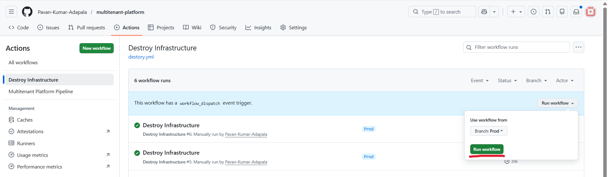

# Multitenant Platform

## Overview

A shared platform where technical teams submit zip files for processing. Each run provisions infrastructure, uploads the file, validates it via Lambda, processes it via ECS Fargate, and audits every step in DynamoDB.

Technical stack:

AWS:

- S3 Storage: terraform statefile and upload zip file
- ECR: container repository to store processor Docker image
- S3 event trigger -> lambda
- Lambda: used to validate the uploded file and trigger ECS task
- ECS Fargate: containerized workload (Docker) to process the data
- DynamoDB: persistant database to store audit logs

Git, GitHub Actions

Repo info:

The repo contains the below mentioned folders and files

multitenant-platform
│ .gitignore
│ image.png
│ README.md
│ runworkflow_manually.png
│
├───.github
│ └───workflows
└─── destory.yml  
 process_pipeline.yml
│
├───.venv
│
├───docs
├───infra
│ │ version.tf
│ │
│ ├───environments
│ │ └───dev
│ │ main.tf
│ │ outputs.tf
│ │ provider.tf
│ │ state.tf
│ │ terraform.tfvars
│ │ variables.tf
│ │
│ └───modules
│ ├───dynamodb
│ │ main.tf
│ │ outputs.tf
│ │ variables.tf
│ │
│ ├───iam
│ │ main.tf
│ │ outputs.tf
│ │ variables.tf
│ │
│ ├───lambda
│ │ main.tf
│ │ outputs.tf
│ │ variables.tf
│ │
│ └───s3
│ main.tf
│ outputs.tf
│ variables.tf
│
└───src
├───lambda
└───validator
│ handler.py
│
└───processor
Dockerfile
process.py
requirements.txt

## Architecture

```
GitHub Release (zip attached)
        │
        ▼
GitHub Actions
  ├── terraform apply  →  S3, Lambda, DynamoDB, ECS Fargate cluster, ECR
  ├── docker build/push →  ECR
  └── aws s3 cp  ──────────────────────────►  S3 bucket (uploads/)
                                                      │
                                              S3 PutObject event
                                                      │
                                                      ▼
                                             Lambda Validator
                                             ├── reads org-id tag
                                             ├── validates size/type
                                             ├── writes VALIDATED → DynamoDB
                                             └── ecs:RunTask (Fargate)
                                                      │
                                                      ▼
                                             ECS Fargate (data-processor)
                                             ├── downloads zip from S3
                                             ├── logs file contents
                                             └── writes COMPLETE → DynamoDB
```

---

## AWS Admin (one-time setup)

overview:

- Created group `multitenant-platform-company-developers` (add least-privilege permissions — see below)
- Created S3 bucket for Terraform state: `multitenant-platform-terraform-statefiles` in `us-east-1`
- Added GitHub repo secrets: `STATEFILE_BUCKET_NAME`, `STATEFILE_BUCKET_REGION`

**Minimum IAM permissions for the group**

```json
{
  "Version": "2012-10-17",
  "Statement": [
    {
      "Effect": "Allow",
      "Action": ["s3:*"],
      "Resource": "arn:aws:s3:::multitenant-platform-*"
    },
    {
      "Effect": "Allow",
      "Action": ["dynamodb:*"],
      "Resource": "arn:aws:dynamodb:*:*:table/multitenant-platform-*"
    },
    {
      "Effect": "Allow",
      "Action": ["lambda:*"],
      "Resource": "arn:aws:lambda:*:*:function:multitenant-platform-*"
    },
    {
      "Effect": "Allow",
      "Action": ["iam:*"],
      "Resource": "arn:aws:iam::*:role/multitenant-platform-*"
    },
    {
      "Effect": "Allow",
      "Action": ["logs:*"],
      "Resource": "arn:aws:logs:*:*:*"
    },
    {
      "Effect": "Allow",
      "Action": ["ecs:*"],
      "Resource": "*"
    },
    {
      "Effect": "Allow",
      "Action": ["ecr:*"],
      "Resource": "*"
    }
    {
      "Effect": "Allow",
      "Action": [
        "ec2:CreateSecurityGroup",
        "ec2:DeleteSecurityGroup",
        "ec2:AuthorizeSecurityGroupEgress",
        "ec2:RevokeSecurityGroupEgress",
        "ec2:DescribeSecurityGroups",
        "ec2:DescribeSecurityGroupRules"
      ],
      "Resource": "*"
    }
  ]
}
```

Create Service Linked Role for ECS (AWSServiceRoleForECS):

Admin steps in AWS Console:

    Go to IAM → Roles → Create role

    Select AWS service

    Under "Use case" search for Elastic Container Service

    Select Elastic Container Service (not ECS Task)

    Click Next through the rest and Create role

```json
{
  "Effect": "Allow",
  "Action": ["iam:CreateServiceLinkedRole"],
  "Resource": "arn:aws:iam::*:role/aws-service-role/ecs.amazonaws.com/*",
  "Condition": {
    "StringEquals": {
      "iam:AWSServiceName": "ecs.amazonaws.com"
    }
  }
}
```

- In GitHub Repo settings, **Actions secrets and variables** section created the below secrets.

  Repository secrets:
  - STATEFILE_BUCKET_NAME
  - STATEFILE_BUCKET_REGION

Note:

Upon the request, admin will create user based on the request

Example:

- user: multitenant-platform-company-pavan
- Adding user to "multitenant-platform-company-developers" group
- "created Access keys" to user for creating AWS services using AWS CLI
- The AWS Security credentials will shared to developer / technical person

---

## Developers / Data scientists (how to run)

### Prerequisites

You need from the AWS Admin (Contact could admin asking the following details):

- `AWS_ACCESS_KEY_ID`
- `AWS_SECRET_ACCESS_KEY`
- `AWS_DEFAULT_REGION`

For now, use GitHub Repository secrets (Settings → Secrets → Actions) so the person can able to run the workflow especailly IaC.

Note:

Technical person need to make request:

- I am <name> and <your role> and <project>. What kind of support he/her need?

Response from Admin:

- Created user (username) and add to the group (multitenant-platform-company-developers) and will provide (Access key ID, Secret access key) also Region.

---

## How to Run the Pipeline

1. Go to **Releases** → **Draft a new release**
2. Set a tag (e.g. `v1.0.0`) and title
3. **Attach your `.zip` file** as a release asset
4. Click **Publish release** — the workflow starts automatically

The pipeline will:

1. Provision all AWS infrastructure via Terraform
2. Build and push the processor Docker image to ECR
3. Upload your zip to S3 (tagged with your GitHub org as `organization-id`)
4. S3 event auto-triggers Lambda validator
5. Lambda validates and launches an ECS Fargate task
6. Audit records written to DynamoDB at every step

---

## Teardown

Go to Actions in GitHub and select **Destroy Infrastructure** workflow (destroy.yml). Run the workflow manually by clicking **Run Workflow**


