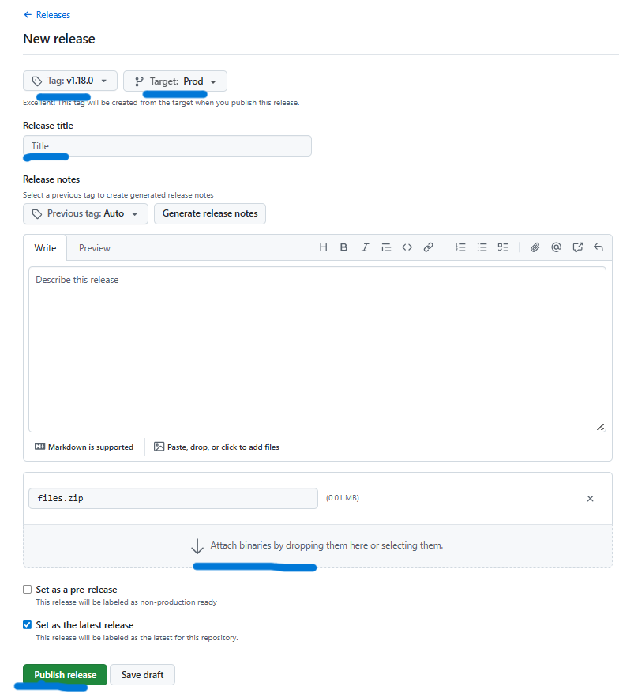

# Multitenant Platform

A shared platform for automated zip file processing. Each run provisions cloud infrastructure, validates the uploaded file via a serverless trigger, processes it inside a container, and records every step in an audit database.

```
GitHub Release (zip attached)
        │
        ▼
GitHub Actions
  ├── terraform apply  ──────> S3, Lambda, DynamoDB, ECS Cluster, ECR
  ├── docker build/push ──────> ECR
  └── aws s3 cp ──────────────────────────────> S3 bucket (uploads/)
                                                        │
                                                S3 PutObject event

                                                        ↓

                                            Lambda Validator (Python)
                                            ├── reads organization-id tag
                                            ├── validates size & content-type
                                            ├── writes VALIDATED → DynamoDB
                                            └── ecs:RunTask

                                                        ↓

                                            ECS Fargate (data-processor)
                                            ├── downloads zip from S3
                                            ├── logs file contents & stats
                                            └── writes COMPLETE → DynamoDB
```

---

## Tech Stack

| Layer      | Service                        |
| ---------- | ------------------------------ |
| Storage    | AWS S3 (upload bucket + state) |
| Compute    | AWS ECS Fargate (Docker)       |
| Serverless | AWS Lambda (Python 3.12)       |
| Registry   | AWS ECR                        |
| Audit DB   | AWS DynamoDB                   |
| IaC        | Terraform                      |
| CI/CD      | GitHub Actions                 |

---

## Repository Layout

```
multitenant-platform/
├── .github/workflows/
│   ├── process_pipeline.yml   # Main pipeline — triggers on GitHub release
│   └── destroy.yml            # Manual teardown workflow
│
├── infra/
│   ├── version.tf             # Terraform & provider version constraints
│   ├── environments/dev/
│   │   ├── main.tf            # All resource definitions for dev
│   │   ├── variables.tf       # Input variable declarations
│   │   ├── outputs.tf         # Exported values (bucket name, Lambda, etc.)
│   │   ├── provider.tf        # AWS provider
│   │   ├── state.tf           # S3 remote backend (values injected at init)
│   │   └── terraform.tfvars   # Default values — update vpc_id & subnet_id
│   └── modules/
│       ├── s3/                # Encrypted private bucket
│       ├── dynamodb/          # Audit table with PITR
│       ├── iam/               # Lambda least-privilege role & policy
│       └── lambda/            # Function + zip packaging
│
├── src/
│   ├── lambda/validator/
│   │   └── handler.py         # Validate → audit → trigger ECS
│   └── processor/
│       ├── process.py         # Download → inspect zip → audit
│       ├── Dockerfile         # python:3.12-slim, non-root user
│       └── requirements.txt
│
└── docs/
    ├── README.md              # Deployment & testing guide
    └── HYBRID-STRATEGY.md     # On-premises decoupling strategy
```

---

## AWS Admin — One-Time Setup

These steps are completed once per project by the AWS administrator.

### 1. Create the Terraform State Bucket

Create an S3 bucket named `multitenant-platform-terraform-statefiles` in `us-east-1` with versioning enabled. This bucket stores Terraform state files.

> If you use a different name, update the `STATEFILE_BUCKET_NAME` GitHub secret accordingly.

### 2. Create the Developer IAM Group

Create a group named `multitenant-platform-company-developers` and attach the following least-privilege policy:

```json
{
  "Version": "2012-10-17",
  "Statement": [
    {
      "Effect": "Allow",
      "Action": ["s3:*"],
      "Resource": "arn:aws:s3:::multitenant-platform-*"
    },
    {
      "Effect": "Allow",
      "Action": ["dynamodb:*"],
      "Resource": "arn:aws:dynamodb:*:*:table/multitenant-platform-*"
    },
    {
      "Effect": "Allow",
      "Action": ["lambda:*"],
      "Resource": "arn:aws:lambda:*:*:function:multitenant-platform-*"
    },
    {
      "Effect": "Allow",
      "Action": ["iam:*"],
      "Resource": "arn:aws:iam::*:role/multitenant-platform-*"
    },
    {
      "Effect": "Allow",
      "Action": ["logs:*"],
      "Resource": "arn:aws:logs:*:*:*"
    },
    {
      "Effect": "Allow",
      "Action": ["ecs:*"],
      "Resource": "*"
    },
    {
      "Effect": "Allow",
      "Action": ["ecr:*"],
      "Resource": "*"
    },
    {
      "Effect": "Allow",
      "Action": [
        "ec2:CreateSecurityGroup",
        "ec2:DeleteSecurityGroup",
        "ec2:AuthorizeSecurityGroupEgress",
        "ec2:RevokeSecurityGroupEgress",
        "ec2:DescribeSecurityGroups",
        "ec2:DescribeSecurityGroupRules"
      ],
      "Resource": "*"
    }
  ]
}
```

### 3. Create the ECS Service-Linked Role

This is required for ECS to manage Fargate tasks on your behalf.

**Via AWS Console:** IAM → Roles → Create role → AWS service → Elastic Container Service (not ECS Task) → click through and create.

**Via CLI:**

```bash
aws iam create-service-linked-role --aws-service-name ecs.amazonaws.com
```

### 4. Provision Developer Users

For each developer who needs access:

1. Create an IAM user (e.g. `multitenant-platform-company-<name>`)
2. Add the user to `multitenant-platform-company-developers`
3. Generate an Access Key (Access Key ID + Secret Access Key)
4. Share credentials along with the AWS region, VPC ID, and Subnet ID

---

## Developer Setup — GitHub Secrets

Add the following secrets to your repository at **Settings → Secrets and variables → Actions**:

| Secret                    | Source        | Description                          |
| ------------------------- | ------------- | ------------------------------------ |
| `AWS_ACCESS_KEY_ID`       | From admin    | IAM user access key                  |
| `AWS_SECRET_ACCESS_KEY`   | From admin    | IAM user secret key                  |
| `AWS_DEFAULT_REGION`      | From admin    | Target region (e.g. `us-east-1`)     |
| `VPC_ID`                  | From admin    | VPC for ECS security group           |
| `SUBNET_ID`               | From admin    | Public subnet for Fargate tasks      |
| `STATEFILE_BUCKET_NAME`   | Admin / fixed | S3 bucket holding Terraform state    |
| `STATEFILE_BUCKET_REGION` | Admin / fixed | Region of the Terraform state bucket |

> **Note:** Using long-lived IAM access keys is functional but not ideal. A future improvement is OIDC federation (`role-to-assume` in `aws-actions/configure-aws-credentials`), which eliminates the need to store static credentials.

---

## How to Run the Pipeline

### Step 1 — Prepare a zip file

Any valid `.zip` works. To create a test file:

```bash
echo "hello" > sample.txt
zip mydata.zip sample.txt
```

### Step 2 — Create a GitHub Release

1. Go to **Releases → Draft a new release**
2. Set a tag (e.g. `v1.0.0`) and a title
3. Drag and drop your `.zip` file into the assets section
4. Click **Publish release** — the workflow starts automatically



### Step 3 — Monitor progress

Go to **Actions → Multitenant Platform Pipeline** to follow the 7 steps:

| Step | Action                                        |
| ---- | --------------------------------------------- |
| 1/7  | Validate that exactly one `.zip` is attached  |
| 2/7  | Download the zip from the release             |
| 3/7  | Terraform init → validate → plan → apply      |
| 4/7  | Build & push Docker image to ECR              |
| 5/7  | Upload zip to S3 with `organization-id` tag   |
| 6/7  | Stream Lambda validator logs (auto-triggered) |
| 7/7  | Stream ECS processor logs + query audit trail |

---

## Verify the Audit Trail

After the pipeline completes, query DynamoDB to confirm all three events were recorded:

```bash
aws dynamodb query \
  --table-name multitenant-platform-dev-audit \
  --key-condition-expression "org_id = :oid" \
  --expression-attribute-values '{":oid":{"S":"<your-github-org>"}}' \
  --output table \
  --query 'Items[*].{Timestamp:timestamp.S,Event:event_type.S,Status:status.S,Details:details.S}'
```

Expected audit trail:

| Event              | Status  | Details                                      |
| ------------------ | ------- | -------------------------------------------- |
| `VALIDATED`        | SUCCESS | org-id=\<org\>, size=\<n\>MB                 |
| `PROCESSING_START` | SUCCESS | ECS Fargate task: \<task-id\>                |
| `COMPLETE`         | SUCCESS | Processed \<file\>.zip, \<n\>MB, \<n\> files |

View ECS container logs directly:

```bash
aws logs tail /ecs/multitenant-platform-dev-processor --since 10m --format short
```

---

## Teardown

Go to **Actions → Destroy Infrastructure** and click **Run workflow**. This runs `terraform destroy -auto-approve` and removes all provisioned resources.

> The S3 upload bucket uses `force_destroy = true` — all objects inside it are deleted without confirmation. Back up any files you need before destroying.

The Terraform state bucket and IAM group are not managed by Terraform and must be deleted manually in the AWS Console if no longer needed.


---

## Improvement Scope

1. **OIDC authentication** — replace static IAM access keys with GitHub OIDC federation to eliminate long-lived credentials in secrets.
2. **Pipeline automation** — trigger the workflow automatically when a file is uploaded to Google Drive or another source using n8n or a custom webhook, removing the manual release step.
3. **Multi-environment support** — add `staging` and `prod` directories under `infra/environments/` with separate state keys.
4. **Failure alerting** — add an EventBridge rule on DynamoDB Streams to send an SNS notification whenever a `status=FAILED` record is written.
