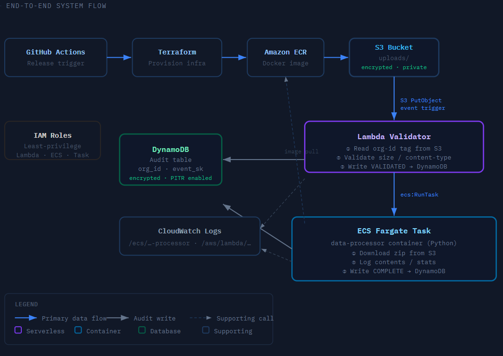
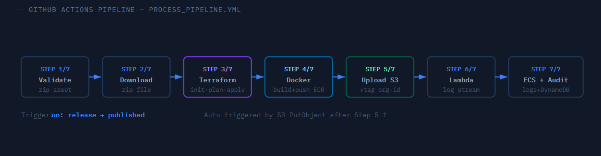

# Deployment & Testing Guide

This guide walks through deploying the Multitenant Platform from scratch and verifying that every stage of the pipeline completes successfully.



---

## Prerequisites

Before running the pipeline, you need credentials and network details from the AWS admin. Contact the admin stating your name, role, and project — they will provision an IAM user and share the following:

| Credential              | Description                                  |
| ----------------------- | -------------------------------------------- |
| `AWS_ACCESS_KEY_ID`     | IAM user access key                          |
| `AWS_SECRET_ACCESS_KEY` | IAM user secret key                          |
| `AWS_DEFAULT_REGION`    | Target AWS region (e.g. `us-east-1`)         |
| `VPC_ID`                | VPC where ECS security group will be created |
| `SUBNET_ID`             | Public subnet for Fargate task networking    |

---

## Part 1 — AWS Admin Setup (One Time)

> Skip this section if the admin has already completed setup for the project.

### 1.1 Create the Terraform State Bucket

In the AWS Console (or CLI), create an S3 bucket to store Terraform state files:

- **Name:** `multitenant-platform-terraform-statefiles`
- **Region:** `us-east-1`
- **Versioning:** enabled

> If you use a different name, update the `STATEFILE_BUCKET_NAME` secret in GitHub accordingly.

### 1.2 Create the Developer IAM Group

1. Go to **IAM → User groups → Create group**
2. Name: `multitenant-platform-company-developers`
3. Attach the inline policy below

```json
{
  "Version": "2012-10-17",
  "Statement": [
    {
      "Effect": "Allow",
      "Action": ["s3:*"],
      "Resource": "arn:aws:s3:::multitenant-platform-*"
    },
    {
      "Effect": "Allow",
      "Action": ["dynamodb:*"],
      "Resource": "arn:aws:dynamodb:*:*:table/multitenant-platform-*"
    },
    {
      "Effect": "Allow",
      "Action": ["lambda:*"],
      "Resource": "arn:aws:lambda:*:*:function:multitenant-platform-*"
    },
    {
      "Effect": "Allow",
      "Action": ["iam:*"],
      "Resource": "arn:aws:iam::*:role/multitenant-platform-*"
    },
    {
      "Effect": "Allow",
      "Action": ["logs:*"],
      "Resource": "arn:aws:logs:*:*:*"
    },
    {
      "Effect": "Allow",
      "Action": ["ecs:*"],
      "Resource": "*"
    },
    {
      "Effect": "Allow",
      "Action": ["ecr:*"],
      "Resource": "*"
    },
    {
      "Effect": "Allow",
      "Action": [
        "ec2:CreateSecurityGroup",
        "ec2:DeleteSecurityGroup",
        "ec2:AuthorizeSecurityGroupEgress",
        "ec2:RevokeSecurityGroupEgress",
        "ec2:DescribeSecurityGroups",
        "ec2:DescribeSecurityGroupRules"
      ],
      "Resource": "*"
    }
  ]
}
```

> **Common mistake:** Ensure every object in the `Statement` array is separated by a comma. A missing comma between Statement blocks is a silent parse error in the AWS Console.

### 1.3 Create the ECS Service-Linked Role

ECS requires a service-linked role to manage Fargate tasks. Create it once per AWS account.

**Via AWS Console:**

1. IAM → Roles → Create role
2. Select **AWS service**
3. Search for **Elastic Container Service** → select **Elastic Container Service** (not ECS Task)
4. Click Next through the rest, then Create role

**Via CLI:**

```bash
aws iam create-service-linked-role --aws-service-name ecs.amazonaws.com
```

### 1.4 Provision a Developer User

For each new user:

1. **IAM → Users → Create user** — name: `multitenant-platform-company-<name>`
2. Add the user to the `multitenant-platform-company-developers` group
3. **Security credentials → Create access key** — select "Application running outside AWS"
4. Download the credentials CSV and share it securely with the developer
5. Also share the AWS region, VPC ID, and a public Subnet ID

---

## Part 2 — GitHub Repository Setup

### 2.1 Add Repository Secrets

Go to **Settings → Secrets and variables → Actions → New repository secret** and add each of the following:

| Secret                    | Value                                       |
| ------------------------- | ------------------------------------------- |
| `AWS_ACCESS_KEY_ID`       | From admin                                  |
| `AWS_SECRET_ACCESS_KEY`   | From admin                                  |
| `AWS_DEFAULT_REGION`      | From admin (e.g. `us-east-1`)               |
| `VPC_ID`                  | From admin                                  |
| `SUBNET_ID`               | From admin                                  |
| `STATEFILE_BUCKET_NAME`   | `multitenant-platform-terraform-statefiles` |
| `STATEFILE_BUCKET_REGION` | `us-east-1`                                 |

### 2.2 Update Terraform Variables

Edit `infra/environments/dev/terraform.tfvars` and replace the placeholder VPC and subnet values with those provided by the admin:

```hcl
aws_region   = "us-east-1"
project_name = "multitenant-platform"
environment  = "dev"

vpc_id    = "vpc-xxxxxxxxxxxxxxx"    # your VPC ID
subnet_id = "subnet-xxxxxxxxxxxxxxx" # a public subnet in that VPC
```

> **Terraform backend note:** The S3 backend block in `state.tf` does not support variable interpolation. The `bucket` and `region` values are injected at `terraform init` time via `-backend-config` flags. This is handled automatically by the pipeline using the `STATEFILE_BUCKET_NAME` and `STATEFILE_BUCKET_REGION` secrets — no manual action needed.

---

## Part 3 — Running the Pipeline

### Step 1 — Prepare a zip file

Any valid `.zip` file works. To create a minimal test file:

```bash
echo "hello world" > sample.txt
zip mydata.zip sample.txt
```

### Step 2 — Create a GitHub Release

1. Go to your repository → **Releases** → **Draft a new release**
2. Click **Choose a tag** and type a new tag (e.g. `v1.0.0`)
3. Add a release title
4. Drag and drop your `.zip` file into the **Assets** area at the bottom
5. Click **Publish release**

The **Multitenant Platform Pipeline** workflow starts automatically.

> Only one `.zip` file may be attached per release. The pipeline will fail at Step 1 if zero or more than one zip is found.


### Step 3 — Monitor the workflow

Go to **Actions → Multitenant Platform Pipeline** and click the running workflow.

The pipeline executes these steps in order:



| Step | Name                      | What happens                                             |
| ---- | ------------------------- | -------------------------------------------------------- |
| 1/7  | Validate release asset    | Checks exactly one `.zip` is attached; extracts its URL  |
| 2/7  | Download zip asset        | Downloads and renames the file for clean S3 keys         |
| 3/7  | Terraform init/plan/apply | Provisions all AWS resources if not already present      |
| 4/7  | Build & push Docker image | Builds `src/processor/` and pushes to ECR                |
| 5/7  | Upload zip to S3          | Uploads file, sets `organization-id` tag from GitHub org |
| 6/7  | Stream Lambda logs        | Waits 15s, then tails Lambda CloudWatch logs             |
| 7/7  | ECS logs + audit trail    | Waits 45s, tails ECS logs, queries DynamoDB audit table  |

> Steps 3 and 4 are idempotent. Re-running the pipeline on an already-provisioned environment is safe — Terraform will detect no changes and Docker will overwrite the `latest` image tag.

---

## Part 4 — Verifying the Results

### 4.1 Check the Audit Trail

After the pipeline finishes, query DynamoDB directly:

```bash
aws dynamodb query \
  --table-name multitenant-platform-dev-audit \
  --key-condition-expression "org_id = :oid" \
  --expression-attribute-values '{":oid":{"S":"<your-github-org>"}}' \
  --output table \
  --query 'Items[*].{Timestamp:timestamp.S,Event:event_type.S,Status:status.S,Details:details.S}'
```

A successful run produces three records in order:

| Event              | Status  | Details                                  |
| ------------------ | ------- | ---------------------------------------- |
| `VALIDATED`        | SUCCESS | `org-id=<org>, size=<n>MB`               |
| `PROCESSING_START` | SUCCESS | `ECS Fargate task: <task-id>`            |
| `COMPLETE`         | SUCCESS | `Processed <file>.zip, <n>MB, <n> files` |

If you see `VALIDATION_FAILED` or `ERROR`, check the `Details` column for the specific failure reason (e.g. missing tag, file too large).

### 4.2 View Lambda Logs

```bash
aws logs tail /aws/lambda/multitenant-platform-dev-validator \
  --since 10m \
  --format short
```

### 4.3 View ECS Container Logs

```bash
aws logs tail /ecs/multitenant-platform-dev-processor \
  --since 10m \
  --format short
```

---

## Teardown

To destroy all provisioned AWS infrastructure:

1. Go to **Actions** → select **Destroy Infrastructure**
2. Click **Run workflow → Run workflow**

The workflow runs `terraform destroy -auto-approve`, which removes all resources created by Terraform including the S3 upload bucket, Lambda function, ECS cluster, ECR repository, DynamoDB table, IAM roles, and security group.

> The S3 upload bucket is configured with `force_destroy = true`. All objects inside it are permanently deleted without a confirmation prompt. Back up any files you need before running teardown.

**Resources not managed by Terraform** (must be deleted manually if no longer needed):

- The Terraform state S3 bucket (`multitenant-platform-terraform-statefiles`)
- The IAM group (`multitenant-platform-company-developers`)
- Any IAM users provisioned by the admin
